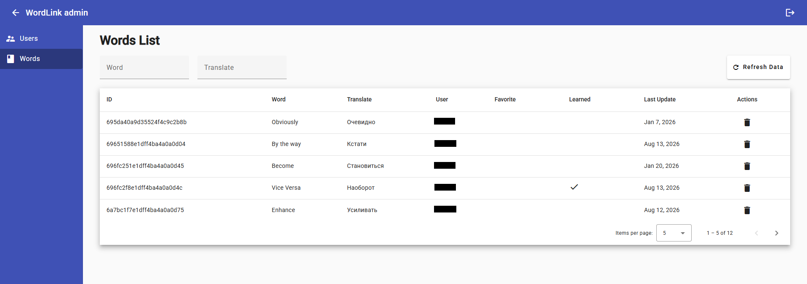

# WordLinkWeb

Backend API and admin panel for WordLink vocabulary learning.  
Serves the mobile client and provides an Angular admin UI for users and words.

> Related repositories:  
> - [WordLinkWeb](https://github.com/seredokhov/WordLinkWeb) — backend + admin panel  
> - [WordLinkApp](https://github.com/seredokhov/WordLinkApp) — React Native client

## Screenshots



## Features

- Admin login (JWT)
- Users management (list / create / edit / delete)
- Words management (list / delete)
- REST API for the mobile app (auth, words, sync)
- Auth guards and interceptors on the admin frontend
- MongoDB storage (Mongoose)

## Tech stack

**Backend**
- Node.js + Express
- MongoDB + Mongoose
- JWT + bcrypt
- express-validator

**Frontend (admin)**
- Angular 17
- Angular Material / CDK
- RxJS

## Project structure

```text
backend/
  src/
    controllers/   # API controllers
    middlewares/   # auth, admin, errors
    models/        # User, Word
    validations/   # request validators
frontend/
  src/app/
    pages/         # login, main, users, words
    components/    # lists, modals, nav
    services/      # admin / user / word API
    guards/        # auth guard
    interceptors/  # JWT interceptor
```

## Getting started

### Requirements

- Node.js >= 18
- MongoDB
- (optional) Docker

### Backend

```bash
cd backend
npm install
# create .env with DB_URL, SECRET_KEY, ADMIN_PASSWORD, etc.
npm run dev
```

### Frontend (admin)

```bash
cd frontend
npm install
npm start
```

Admin UI: `http://localhost:4200`  
API default port: `3000` (see `backend/config.js` / `.env`)

> Configure `API_URL` in `frontend/src/environments/env.ts` and backend `.env` before running.

## Status

Pet project.

## Author

Pavel Seredokhov  
GitHub: [seredokhov](https://github.com/seredokhov)
